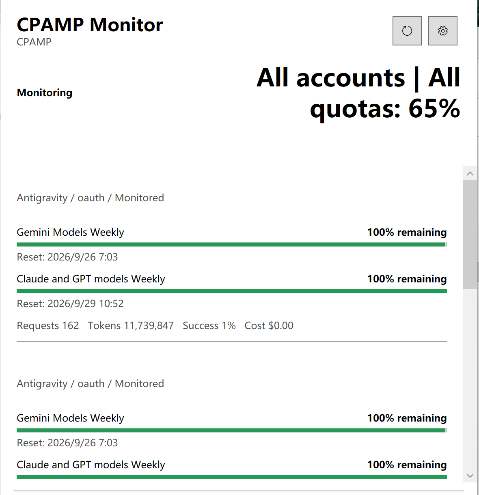

# CPAMP Monitor

[English](README.md) | [简体中文](README_CN.md)

CPAMP Monitor is a native macOS menu-bar application for viewing provider quota and usage information exposed by a CPAMP-compatible management service.

A native **Windows client** is also available, built with C# / WPF, without WebView or Electron. It supports x64 and ARM64, direct HTTPS connections, tray monitoring, notifications, Credential Manager storage and sign-in startup. SSH is not included in the Windows version. See [Windows setup and validation status](windows/README.md).

macOS and Windows downloads are published together in each stable `v*` [Release](https://github.com/okert/CPAMPMonitor/releases). Windows packages are native WPF applications for x64 and ARM64; SSH is intentionally not included.

## Features

- Shows either the lowest fresh percentage across all monitored accounts or a selected account's value in the menu bar, with an optional quota-window filter such as 5 hours or weekly.
- Supports Codex, Antigravity and xAI, with Claude OAuth quota parsing support.
- Displays quota windows, reset times and CPAMP usage history.
- Configures the menu-bar display account and quota window, account selection and order, refresh interval and warning thresholds.
- Sends macOS notifications with persistent per-account and per-cycle deduplication.
- Stores the management key in macOS Keychain instead of source files or command-line arguments.
- Supports direct HTTPS and an optional tunnel built from the user's existing SSH configuration.

## Screenshots

The screenshots show the macOS menu-bar dashboard, macOS settings and the native Windows client after a successful connection. Account identifiers are masked; the service address and email addresses shown in the screenshots are not real.

<p align="center">
  
  
  
</p>

## Compatible Service

CPAMP Monitor is a client for CPAMP-compatible management services. The reference service project is [CPA-Manager-Plus](https://github.com/seakee/CPA-Manager-Plus). This repository contains the macOS monitor client, not the service itself.

## Requirements

- macOS 13 or later.
- GitHub Releases provide packages for Apple Silicon (`arm64`) and Intel (`x86_64`) Macs.
- Source builds require Xcode 15+ or Command Line Tools that provide Swift 5.9+.
- A reachable CPAMP-compatible management service and management key.

## Installation

1. Open [GitHub Releases](https://github.com/okert/CPAMPMonitor/releases) and download the package for your Mac: `macOS-arm64` for Apple Silicon or `macOS-x86_64` for Intel.
2. Extract it and move `CPAMP Monitor.app` to Applications.
3. If macOS blocks the non-notarized app on first launch, allow it in System Settings under Privacy & Security.
4. Enter the CPAMP management service HTTPS address and management key in Settings.

Release packages use an ad-hoc signature. They are not signed with an Apple Developer ID certificate and are not notarized. Download from a trusted source and use the SHA-256 file from the Release when verification is needed.

## Build From Source

```sh
swift run MonitorChecks
zsh scripts/build-app.sh
```

The default output is `dist/CPAMP Monitor.app` for the current machine architecture. `dist/`, `release/` and `.build/` are ignored by Git and are not part of the source repository.

To choose another output directory:

```sh
zsh scripts/build-app.sh ./release
```

To build a specific architecture from a compatible macOS toolchain:

```sh
APP_ARCH=arm64 zsh scripts/build-app.sh ./release/arm64
APP_ARCH=x86_64 zsh scripts/build-app.sh ./release/x86_64
```

## Configuration and Security

- Enter the CPAMP management service base URL, for example `https://cpamp.example.com`. Do not enter a model API URL or a URL containing a key.
- The client rejects remote HTTP, embedded credentials, query parameters and redirects to reduce accidental credential disclosure.
- The management key is stored in the current macOS user's Keychain under the `local.cpamp.monitor` service.
- SSH mode uses existing SSH configuration and non-interactive key authentication. It does not accept new host keys or modify SSH configuration.
- The CPAMP service remains responsible for authorization. This client only requests account history, quota and provider data; it is not a server-side read-only boundary.
- Provider quota endpoints are internal and may change. Unknown or expired data is shown as unavailable rather than fabricated as zero.

Do not commit real service addresses, management keys, account files, Keychain exports or personal deployment details to a public repository.

## GitHub Actions Releases

Pushing a `v*` tag runs the macOS and Windows workflows. They build Apple Silicon, Intel, Windows x64 and Windows ARM64 packages in temporary `release/` directories. Build outputs are not committed; they are uploaded as assets to the same GitHub Release and as Actions artifacts.

```sh
git tag v1.0.0
git push origin v1.0.0
```

The app version comes from the tag, so `v1.0.0` produces version `1.0.0` in all packages. Release notes are generated automatically.

## Tests

`MonitorChecks` is a lightweight test runner that does not depend on XCTest, so it also works with Command Line Tools only. It covers URL security validation, quota parsing, null handling, stale data, selectable display-account minimums, alert deduplication, reset cycles and credential identity.

```sh
swift run MonitorChecks
```

## License

This project is licensed under the MIT License. See [LICENSE](LICENSE).
