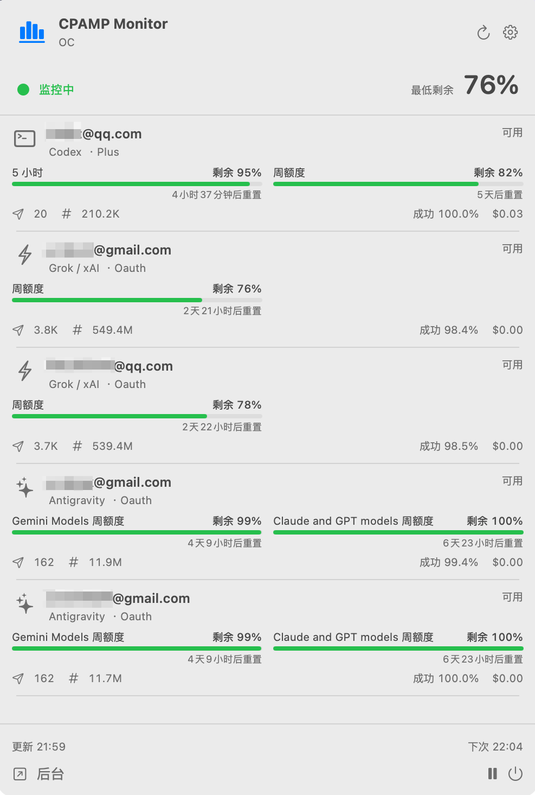
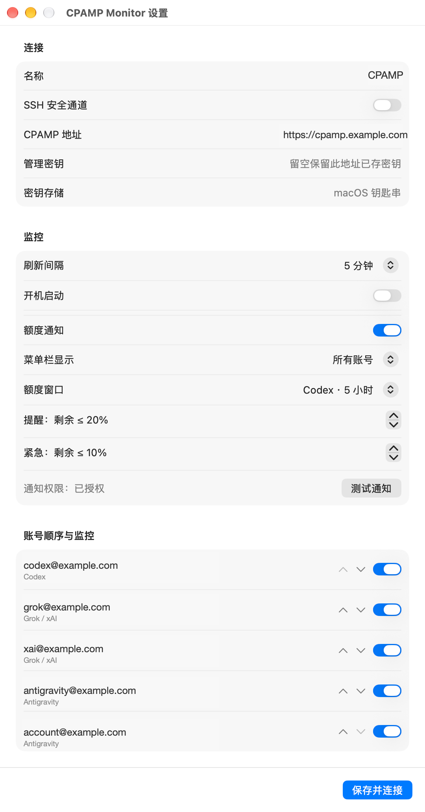

# CPAMP Monitor

[English](README.md) | [简体中文](README_CN.md)

CPAMP Monitor 是一个原生 macOS 菜单栏应用，用于查看 CPAMP 兼容管理服务提供的账号额度和使用情况。

## 功能

- 在菜单栏显示最低剩余额度，点击后查看账号详情。
- 支持 Codex、Antigravity、xAI，并保留 Claude OAuth 额度解析支持。
- 查看 5 小时、周额度、计费周期等窗口及重置时间。
- 查看 CPAMP 提供的请求数、Token、成功率和计算成本历史。
- 支持账号筛选、显示顺序、刷新间隔和告警阈值配置。
- 使用 macOS 通知，并对重复告警进行持久化去重。
- 使用 macOS Keychain 保存管理密钥，不把密钥写入配置文件或命令行参数。
- 支持 HTTPS 直连，也支持通过本机已有 SSH 配置建立可选隧道。

## 截图

以下截图展示菜单栏监控面板和设置窗口。截图中的账号标识已遮挡，设置截图中的服务地址为示例地址。

<p align="center">
  
  
</p>

## 适配的源项目

CPAMP Monitor 是 CPAMP 兼容管理服务的 macOS 客户端，适配的源项目为 [CPA-Manager-Plus](https://github.com/seakee/CPA-Manager-Plus)。本仓库提供的是 macOS 监控客户端，不包含该管理服务本身。

## 系统要求

- macOS 13 或更高版本。
- GitHub Releases 同时提供 Apple Silicon（`arm64`）和 Intel（`x86_64`）Mac 安装包。
- 使用源码编译需要 Xcode 15+ 或包含 Swift 5.9+ 的 Command Line Tools。
- 需要一个可访问的 CPAMP 兼容管理服务和对应的管理密钥。

## 安装

1. 打开 [GitHub Releases](https://github.com/okert/CPAMPMonitor/releases)，根据 Mac 芯片选择安装包：Apple Silicon 选择 `macOS-arm64`，Intel 选择 `macOS-x86_64`。
2. 解压后将 `CPAMP Monitor.app` 移到“应用程序”目录。
3. 首次打开时，如果 macOS 阻止未 notarize 的应用，请在“系统设置 -> 隐私与安全性”中允许打开。
4. 在设置窗口填写 CPAMP 管理服务的 HTTPS 地址和管理密钥。

Release 包使用 ad-hoc 签名，不是 Apple Developer ID 签名，也没有经过 notarization。公开分发时请在可信来源下载，并在需要时自行验证 Release 中的 SHA-256 校验文件。

## 从源码编译

```sh
swift run MonitorChecks
zsh scripts/build-app.sh
```

默认按照当前 Mac 的芯片架构输出到 `dist/CPAMP Monitor.app`。`dist/`、`release/` 和 `.build/` 都已加入 Git 忽略规则，不会被提交到仓库。

手动指定输出目录：

```sh
zsh scripts/build-app.sh ./release
```

也可以通过环境变量指定编译架构：

```sh
APP_ARCH=arm64 zsh scripts/build-app.sh ./release-arm64
APP_ARCH=x86_64 zsh scripts/build-app.sh ./release-x86_64
```

## 配置与安全

- 设置中填写 CPAMP 管理服务的基础地址，例如 `https://cpamp.example.com`；不要填写模型 API 地址或带密钥的 URL。
- 客户端会拒绝远程 HTTP、URL 中的用户名密码、查询参数和重定向，以避免管理密钥被意外发送。
- 管理密钥保存在当前 macOS 用户的 Keychain 中，Keychain 服务标识为 `local.cpamp.monitor`。
- SSH 模式只使用已有的 SSH 配置和非交互式密钥认证，不会自动接受新主机密钥，也不会修改 SSH 配置。
- 管理密钥权限由 CPAMP 服务决定；本客户端只调用额度、账号历史和提供商查询接口，不能替代服务端权限控制。
- 提供商内部额度接口可能变化；无法识别或已过期的数据会显示为不可用，不会伪造为 0%。

不要把真实地址、管理密钥、账号文件、Keychain 导出内容或个人部署信息提交到公开仓库。

## GitHub Actions 发布

仓库中的 `.github/workflows/release.yml` 会在推送 `v*` 标签后运行检查，同时构建 Apple Silicon 和 Intel 版本，并在临时的 `release/` 目录中生成两种 ZIP 包及对应的 SHA-256 文件。构建产物不会提交到 Git 仓库，而会作为 GitHub Release 附件和 Actions artifact 保存。

```sh
git tag v0.1.0
git push origin v0.1.0
```

工作流使用 GitHub 托管的 macOS runner 构建两种芯片架构的版本，并自动生成 Release notes。版本号来自 Git 标签；例如 `v0.2.0` 会生成 `0.2.0` 应用版本。

## 测试

`MonitorChecks` 是不依赖 XCTest 的轻量测试运行器，适用于只安装了 Command Line Tools 的 macOS。它覆盖 URL 安全校验、额度解析、空值处理、过期数据、告警去重、周期切换和账号身份等核心逻辑。

```sh
swift run MonitorChecks
```

## 许可证

本项目采用 MIT 许可证，详见 [LICENSE](LICENSE)。
